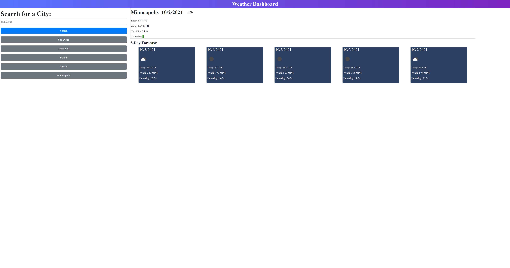

# Weather Dashboard Website
## Link To Deployed Page
[Weather Dashboard Website](https://coleenyart.github.io/weather-dashboard/)

## Objective
A weather dashboard that dynamically updates html and css to show current and five day forecast for a selected city.

Uses:
- jQuery
- Bootstrap
- OpenWeather API

## Screenshot

